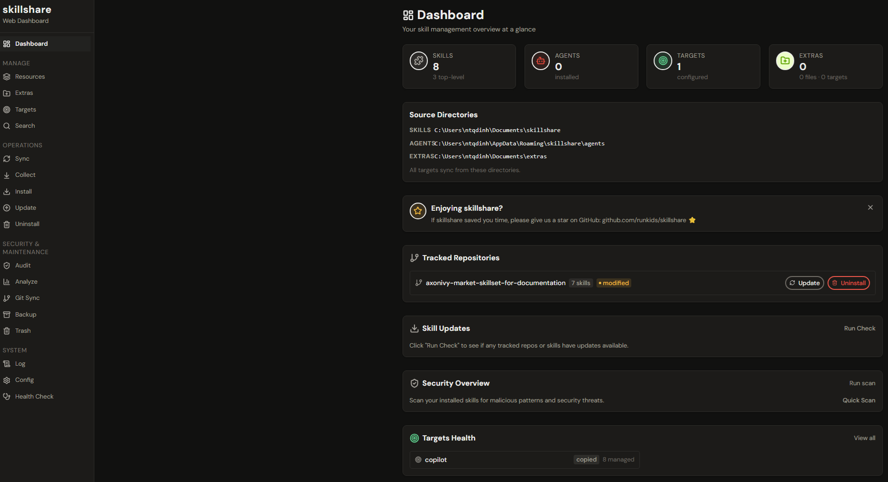
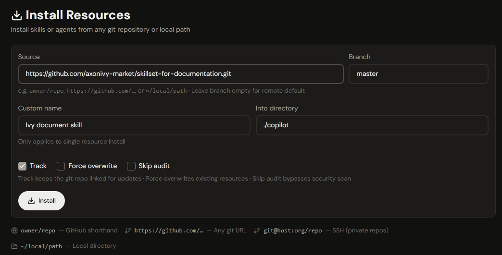
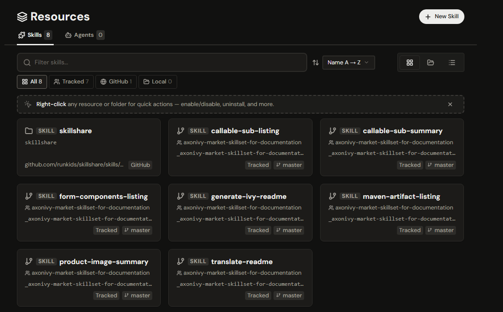
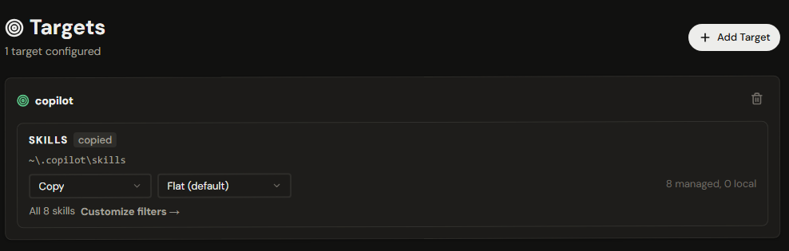
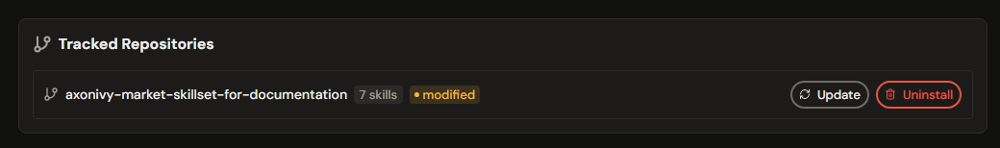

# Axon Ivy Documentation Generation Skills

A curated set of **GitHub Copilot skills and agents** for automated documentation generation in [Axon Ivy](https://www.axonivy.com/) marketplace projects. Install these skills once and let AI generate, translate, and maintain consistent, high-quality product documentation directly from your source code.

---

## Contents

- [Overview](#overview)
- [Skills](#skills)
- [Agents](#agents)
- [Repository Structure](#repository-structure)
- [Using Skills in VS Code with GitHub Copilot](#using-skills-in-vs-code-with-github-copilot)
- [Managing Skills with skillshare](#managing-skills-with-skillshare)
- [Contributing](#contributing)

---

## Overview

This repository provides reusable Copilot skills and an agent mode that automate the most tedious parts of Axon Ivy product documentation:

- Generating structured `README.md` files from process definitions, DataClasses, and configuration files
- Listing callable sub-processes with full parameter signatures
- Documenting form components and HTML dialog fields
- Extracting Maven artifact dependencies
- Cataloguing product screenshots and diagrams
- Translating English README files into German

Skills live in `.github/skills/` and follow the [SKILL.md](https://skillshare.runkids.cc/docs/reference/skill-format) format, making them compatible with GitHub Copilot Chat, VS Code agent mode, and any tool that understands the skillshare protocol.

---

## Skills

### `generate-ivy-readme`

Generates a complete, well-structured `README.md` (and optionally `README_DE.md`) for an Axon Ivy product module.

**What it produces:**
- Non-technical key-features summary (3–8 bullets)
- Callable sub-process reference (via `callable-sub-listing`)
- Form component reference (via `form-components-listing`)
- Demo workflow descriptions
- Setup instructions (roles, REST client configuration)
- Maven artifact dependency snippets (via `maven-artifact-listing`)
- OpenAPI spec links where applicable

**When to use it:** After creating or significantly changing an Axon Ivy product module.

**Skill file:** [.github/skills/generate-ivy-readme/SKILL.md](.github/skills/generate-ivy-readme/SKILL.md)

---

### `callable-sub-listing`

Extracts and documents all `CALLABLE_SUB` process definitions from Axon Ivy `.p.json` files, including connector-tagged `CallSubStart` entries.

**What it produces:**
- Process signatures with sequential numbering
- Input parameter names, types, and descriptions
- Return/result type documentation
- Connector tag identification

**When to use it:** When process JSON files change and the callable sub reference section needs a refresh.

**Skill file:** [.github/skills/callable-sub-listing/SKILL.md](.github/skills/callable-sub-listing/SKILL.md)

---

### `callable-sub-summary`

Produces a marketing-oriented, non-technical summary of the callable sub-processes available in a project.

**What it produces:**
- Feature highlights in plain language
- Capability overview suitable for stakeholders
- Integration guidance

**When to use it:** When preparing product marketing copy or a high-level overview section.

**Skill file:** [.github/skills/callable-sub-summary/SKILL.md](.github/skills/callable-sub-summary/SKILL.md)

---

### `form-components-listing`

Documents form components and HTML dialog fields from the main Axon Ivy module's `src_hd` directory.

**What it produces:**
- DataClass form field inventory
- UI component names and properties
- Usage context for each component

**When to use it:** When form dialogs change and the components reference needs updating.

**Skill file:** [.github/skills/form-components-listing/SKILL.md](.github/skills/form-components-listing/SKILL.md)

---

### `maven-artifact-listing`

Parses the `product.json` file and generates clean Maven dependency documentation.

**What it produces:**
- Sequentially numbered artifact list
- Ready-to-paste Maven `<dependency>` XML snippets
- Artifact metadata (groupId, artifactId, version)

**When to use it:** When dependencies change or a developer setup guide needs updating.

**Skill file:** [.github/skills/maven-artifact-listing/SKILL.md](.github/skills/maven-artifact-listing/SKILL.md)

---

### `product-image-summary`

Discovers and catalogs all images (screenshots, diagrams, GIFs) in a product module and generates ready-to-use Markdown snippets.

**What it produces:**
- Images grouped by subdirectory
- Auto-generated alt-text from filenames
- Copy-paste Markdown image snippets for README integration

**When to use it:** When images are added or reorganized and you need to update screenshot sections.

**Skill file:** [.github/skills/product-image-summary/SKILL.md](.github/skills/product-image-summary/SKILL.md)

---

### `translate-readme`

Translates an existing `README.md` into German and writes the result to `README_DE.md`.

**What it produces:**
- Idiomatic German translation using informal `du`/`dein` tone
- All code blocks, image paths, and URLs preserved verbatim
- Merged into an existing `README_DE.md` if one is present

**When to use it:** After the English README is finalized or updated.

**Skill file:** [.github/skills/translate-readme/SKILL.md](.github/skills/translate-readme/SKILL.md)

---

## Agents

### `Ivy README Generator`

A VS Code agent mode that orchestrates the full documentation generation workflow end-to-end.

**What it does:**
1. Reads the `generate-ivy-readme` skill instructions.
2. Runs all sub-skills in parallel (callable subs, form components, Maven artifacts, images).
3. Writes or merges `README.md` into the product module.
4. Writes or merges the German `README_DE.md`.

**How to invoke it in VS Code:**

Open Copilot Chat, switch to **Agent** mode, select **Ivy README Generator**, and type:

```
Generate readme
```

or

```
Update the readme for my Axon Ivy product
```

**Agent file:** [.github/agents/generate-ivy-readme.agent.md](.github/agents/generate-ivy-readme.agent.md)

---

## Repository Structure

```
.github/
├── agents/
│   └── generate-ivy-readme.agent.md   # VS Code agent mode definition
├── skills/
│   ├── callable-sub-listing/
│   │   ├── SKILL.md
│   │   ├── references/
│   │   └── scripts/
│   ├── callable-sub-summary/
│   │   └── SKILL.md
│   ├── form-components-listing/
│   │   └── SKILL.md
│   ├── generate-ivy-readme/
│   │   ├── SKILL.md
│   │   └── references/
│   ├── maven-artifact-listing/
│   │   └── SKILL.md
│   ├── product-image-summary/
│   │   ├── SKILL.md
│   │   └── scripts/
│   └── translate-readme/
│       └── SKILL.md
└── CODEOWNERS
```

---

## Using Skills in VS Code with GitHub Copilot

Skills under `.github/skills/` are automatically picked up by the GitHub Copilot extension when this repository is open in VS Code. You can also invoke them explicitly in Copilot Chat:

**Generate a full README:**

```
Use the generate-ivy-readme skill to create a README for my Axon Ivy project
```

**Refresh callable sub documentation:**

```
Use callable-sub-listing to regenerate the callable sub section from processes/*.p.json
```

**Translate to German:**

```
Use translate-readme to create README_DE.md for my-connector-product
```

**Catalog product images:**

```
Use product-image-summary to list all images in my-connector-product
```

---

## Managing Skills with skillshare

[skillshare](https://github.com/runkids/skillshare) is a single-binary CLI tool that installs skills from any Git host and syncs them to all your AI tools — GitHub Copilot, Claude Code, Cursor, Codex, and 60+ more — from one source of truth.

### Install skillshare

**macOS / Linux:**

```bash
curl -fsSL https://raw.githubusercontent.com/runkids/skillshare/main/install.sh | sh
```

**Windows (PowerShell):**

```powershell
irm https://raw.githubusercontent.com/runkids/skillshare/main/install.ps1 | iex
```

**Homebrew:**

```bash
brew install skillshare
```

### Install skills from this repository

```bash
skillshare install github.com/axonivy-market/skillset-for-documentation
```

This downloads all skills and agents into your local skillshare source directory:

| Platform | Skills directory |
|----------|-----------------|
| macOS / Linux | `~/.config/skillshare/` |
| Windows | `%AppData%\skillshare\` |

### Configure targets (one-time setup)

Tell skillshare which AI tools you want to sync skills to. Run this once per machine — the configuration is saved and reused for every future `sync` and `update`.

```bash
skillshare init
```

`init` auto-detects installed tools (VS Code Copilot, Claude Code, Cursor, Codex, etc.) and adds them as targets. To add or modify a target manually:

```bash
# Add a specific target
skillshare target add copilot

# List all configured targets
skillshare target list

# Switch a target to copy mode if symlinks don't work (e.g. on some Windows setups)
skillshare target <name> --mode copy
```

After this step you never need to configure targets again — `sync` and `update` will always use the saved list.

### Sync skills to your AI tools

After installation and target configuration, push the skills to all configured targets:

```bash
skillshare sync
```

To sync skills and agents together:

```bash
skillshare sync --all
```

### Update to the latest version of the skills

```bash
skillshare update --all
```

Or update only this skill set:

```bash
skillshare update skillset-for-documentation
```

### Set up on a new machine

```bash
skillshare init            # detect targets and create config (one-time)
skillshare install github.com/axonivy-market/skillset-for-documentation
skillshare sync --all      # push skills + agents to every configured target
```

### Audit skills before use

```bash
skillshare audit
```

Scans installed skills for prompt injection and data exfiltration patterns before they reach your AI agent.

### Web dashboard

```bash
skillshare ui
```

Opens a local web dashboard where you can browse, enable/disable, and manage all installed skills visually.

### Web dashboard walkthrough

The skillshare web dashboard provides an interactive UI to install skills, view installed resources, and check update status.

- **Overview:** Browse and manage all targets, enable/disable skills, and view summaries from the main dashboard.

	

- **Install:** Click "Install" on a skill page to add it to your machine.

	

- **Installed skills:** Open the "Resources" view to see installed resources, versions, and status.

	

- **Target locations:** View and manage the locations of your configured targets.

    

- **Update status / Auto-tracking:** The dashboard shows whether a skill is auto-tracked and if updates are available; use the "Update" button or enable auto-tracking to keep skills current.

	


### Upgrade skillshare itself

```bash
skillshare upgrade
```

For full documentation see [skillshare.runkids.cc/docs](https://skillshare.runkids.cc/docs).

---

## Contributing

1. Add a new skill directory under `.github/skills/<skill-name>/`.
2. Create `SKILL.md` with at minimum: `name`, `description`, purpose, inputs, outputs, and behavior steps.
3. Add any implementation scripts to `scripts/` and format references to `references/`.
4. If the skill should be directly invocable by users, set `user-invocable: true` and an `argument-hint` in the SKILL.md frontmatter.
5. Test the skill against a real Axon Ivy project workspace before submitting a pull request.
6. Update this README with the new skill entry.

---

## Related Resources

- [Axon Ivy Market](https://market.axonivy.com/)
- [Axon Ivy Documentation](https://docs.axonivy.com/)
- [GitHub Copilot](https://docs.github.com/en/copilot)
- [skillshare](https://github.com/runkids/skillshare) — cross-tool skill management CLI
- [skillshare Docs](https://skillshare.runkids.cc/docs)

---

## License

MIT — see [LICENSE](LICENSE) for details.
