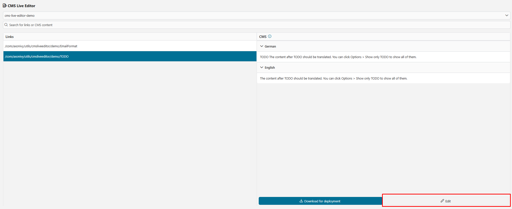
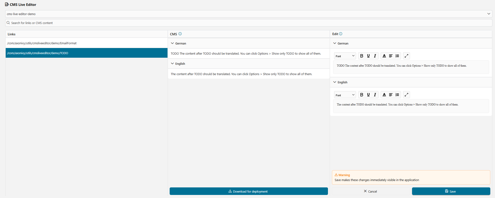
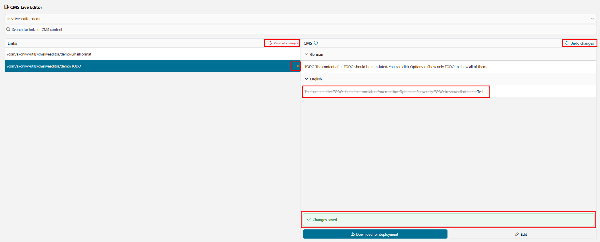
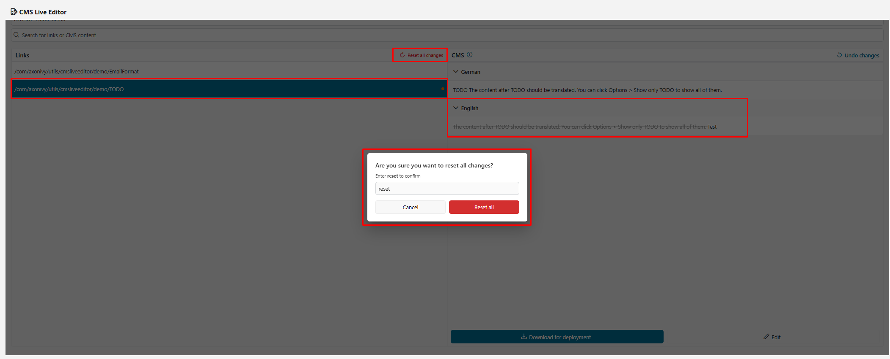

# CMS Live Editor

The CMS Live Editor is an Axon Ivy application that lets content administrators view, edit, and translate CMS entries directly on a running Axon Ivy engine — without redeploying projects. Using a WYSIWYG editor, administrators can update text, HTML, and file-based CMS content across multiple languages, preview changes instantly, and either publish them live to the engine or export them as a deployable ZIP archive.

**Key features:**

- **Live CMS editing** — browse all CMS entries across every deployed project and edit text or HTML content inline with a WYSIWYG editor.
- **Multi-language support** — view and edit all available locales side-by-side in a tabbed interface; compare project defaults against the live application values.
- **Document file management** — upload, replace, and preview file-based CMS entries in PDF, Word (DOC/DOCX), Excel (XLS/XLSX), image (PNG/JPEG), and email (EML/MSG) formats.
- **Document preview** — convert Word, Excel, and email files to PDF on the fly for an in-browser preview before saving.
- **DeepL-powered translation** — translate individual CMS entries or batch-translate multiple entries in one step using the integrated DeepL connector, then review and apply results.
- **Change tracking and undo** — all edits are staged before being committed; pending changes are highlighted, and individual entries or all changes can be undone before saving.
- **Export to ZIP** — download all modified CMS entries as a versioned ZIP archive (Excel workbooks per project) suitable for persistent engine deployment.
- **Search and project filter** — quickly locate CMS entries by URI path or content across all projects, or narrow the view to a single project.

**Exposed callable subprocesses:**

| Process | Signature | Description |
|---------|-----------|-------------|
| `CmsLiveEditor` | `start(showEditorCms: Boolean)` | Opens the CMS Live Editor UI. Pass `true` to launch directly into the CMS editor view. Requires the `CMS_ADMIN` role. |

## Demo

The demo module ships with sample CMS entries in English and German, including text, HTML, and file attachments (PDF, Word, Excel, image), so you can explore every feature without any additional setup.

**Typical workflow:**

1. **Open the editor** — start the `CmsLiveEditor` process. The main page loads, listing all CMS entries from all deployed projects.
2. **Filter by project** — use the *Project* dropdown to narrow the list to a specific project, or leave it on *All Projects* to see everything.
3. **Search for an entry** — type a keyword in the search bar to filter by CMS URI or content value.
4. **Edit an entry** — click the *Edit* button on a row. For text/HTML entries the inline WYSIWYG editor opens; for file entries you can upload a replacement file.
5. **Preview a document** — click the preview icon next to a file entry to open a PDF-rendered preview of the document in a dialog.
6. **Translate content** — open *Settings* to choose source and target language, then click *Translate* on a single entry or select multiple rows and click *Translate All*. Review translated suggestions in the translation dialog before applying.
7. **Undo or reset** — click the undo icon on a row to revert that entry, or use *Reset All Changes* to discard all pending edits at once.
8. **Save to engine** — click *Save* to publish all staged changes immediately to the running engine (changes take effect without redeployment).
9. **Download as ZIP** — click *Download* to export a ZIP archive containing Excel workbooks with all modified CMS values, ready for permanent deployment.

## Setup

### Prerequisites

- Axon Ivy Engine **12.0.8** or later.
- The `cms-live-editor` IAR must be deployed alongside any project whose CMS you wish to manage.
- The optional [DeepL Connector](https://market.axonivy.com/) (`deepl-connector`, version 12.0.3) is required if you want to use the translation feature.

### Roles

Assign the `CMS_ADMIN` role to every user who should have access to the CMS Live Editor. The process is not accessible anonymously.

| Role | Description |
|------|-------------|
| `CMS_ADMIN` | Full access to view, edit, translate, save, and export CMS entries. |

### Variables

Configure the following variable in your engine or project `variables.yaml` if the defaults need adjusting:

| Variable | Default | Description |
|----------|---------|-------------|
| `com.axonivy.utils.cmsliveeditor.MaxUploadedFileSize` | `50` | Maximum allowed size (in MB) for a single uploaded CMS file. |

### Screenshots

| | |
|---|---|
|  |  |
|  |  |
|  |  |
|  |  |
|  |  |
|  |  |
|  |  |
