# CMS Live Editor
In Axon Ivy, languages for UIs, notifications, and emails are managed in the CMS (Content Management System). We are excited to introduce the new CMS Live Editor, which significantly simplifies language editing.

**Key features:**

- Process based, i.e. the CMS Live Editor can be started from the dashboard
- Live edits are enabled (i.e. no deployment necessary)
- User-friendly editor for translating into new languages
- Support for an unlimited number of languages
- Simple styling options

## Demo
### 1. Install the CMS Live Editor
The CMS Live Editor must be installed in the same security context as the project content you want to edit.

### 2. CMS Live Editor process start:
The CMS Live Editor is now available as a process start in the dashboard. Users must have the role `CMS_ADMIN` to see and start the process.

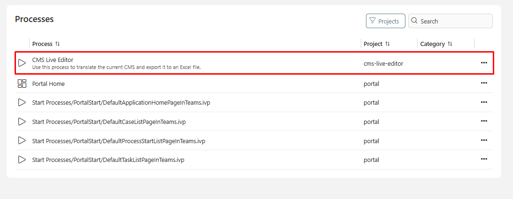

### 3. CMS Live Editor main page:
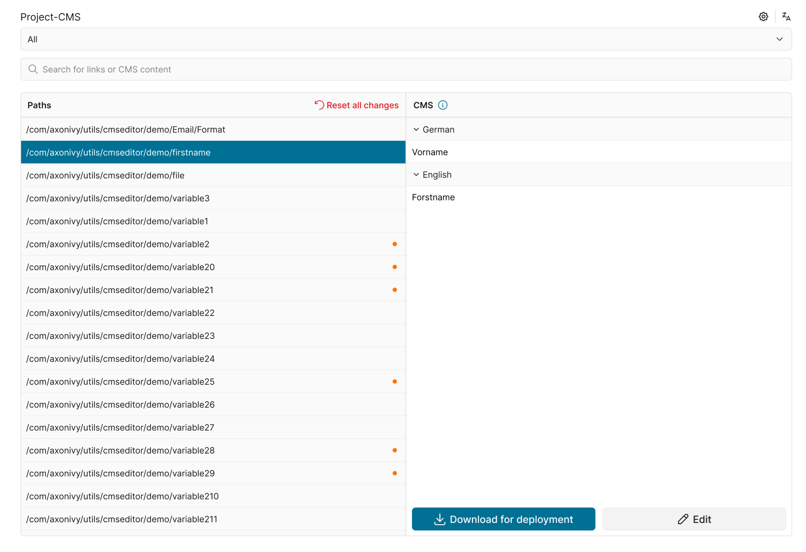

1. Project Selector: Each security context can contain multiple projects. The option "All" will be set as default. Select a project if you want to view the content of a specific project only.
2. Search Input: You can enter text to search by URI or by content. The search is **case-insensitive**.
3. Selected CMS: Display the URI path of the selected content.
4. Edit button: Click to edit this CMS, and another column will be rendered for the user to edit the value for a specific language.
5. Save makes these changes immediately visible in the application

  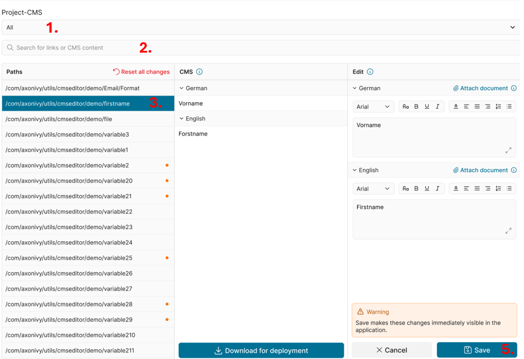

 ### 4. Validation
- When clicking **Save**, the editor validates **numbered placeholders** in the format `{0}`, `{1}`.
  - If **all locales** of the current CMS entry were edited, they must contain the same set of placeholders (order does not matter).
  - If **only specific locales** were edited, each edited locale must contain exactly the same placeholders as its original value.
- When placeholder validation fails:
   - Save is blocked, the affected editor(s) are highlighted, and an error message is shown: **Invalid placeholder syntax.**
   - You cannot switch to another CMS entry, use the search filter, or change the project. A popup appears **Some fields have not been saved yet**. You must **Cancel** or correct your current edits to continue.
- Example: For the CMS entry *UploadFileExists*, the current edits must still contain `{0}`. Do not remove it, rename it (e.g., to `{1}`), remove the brackets, or add extra placeholders in some locales but not others.
   

### 5. File Support

The CMS Live Editor also supports handling files stored in the CMS. Files can be uploaded and previewed:

1. It is possible to preview the content of CMS files. Currently supported file types are Word, Excel, PDF, and images.
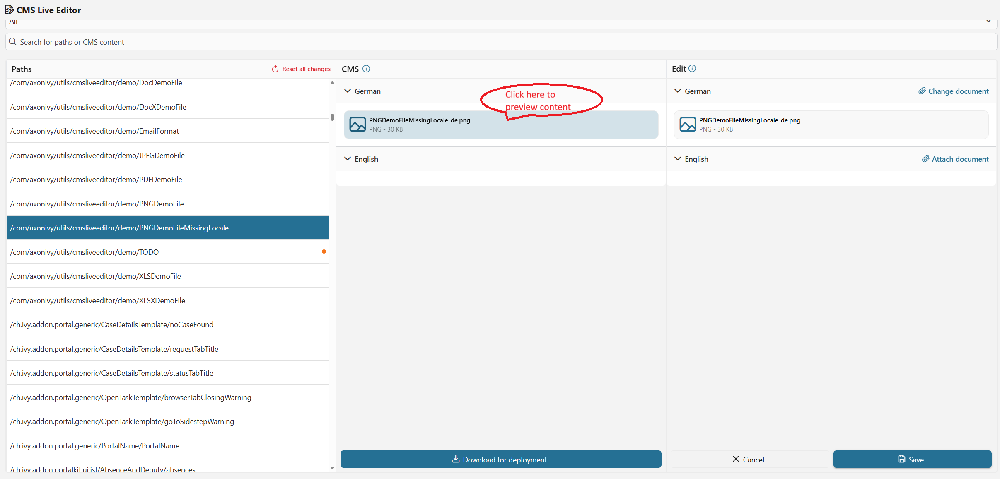
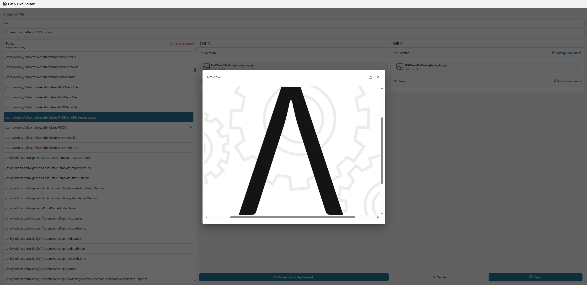

2. You can upload a file of the same type as the existing CMS file by clicking the “Attach/Change Document” link.
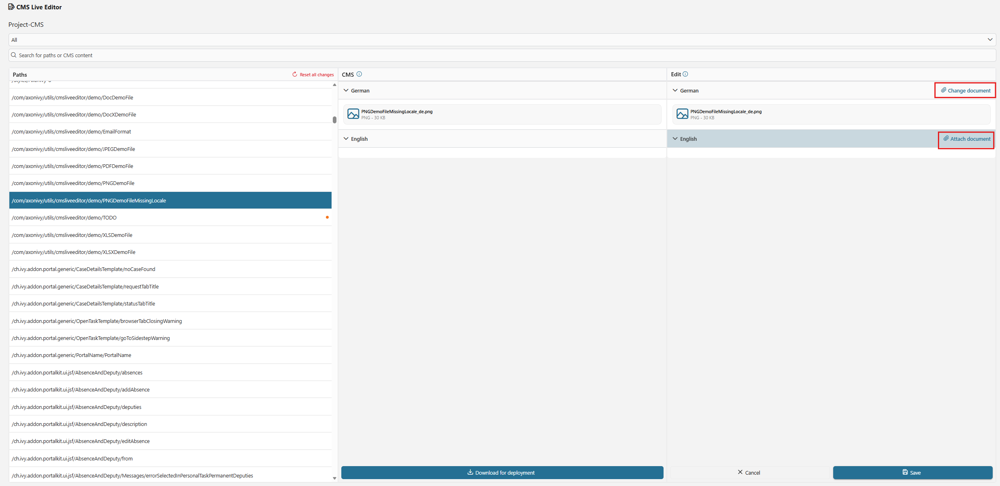
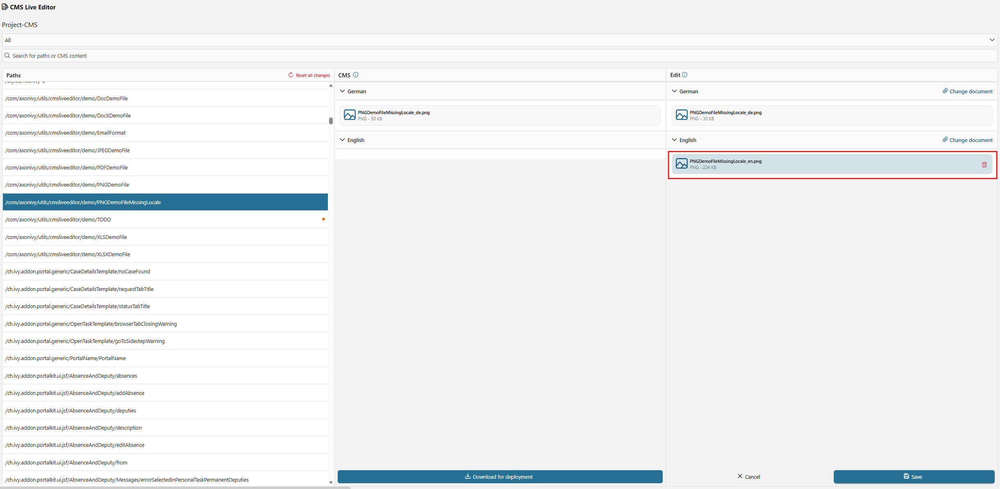

3. An error message will be displayed if the uploaded file type is different from the project's CMS file type, or if the uploaded file size exceeds the allowed limit. The allowed file size limit is configured in the variable `com.axonivy.utils.cmsliveeditor.MaxUploadedFileSize`.
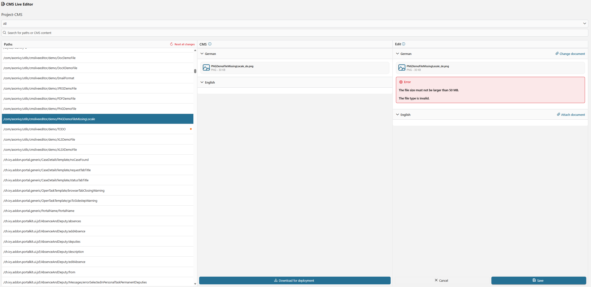

### 6. Undo changes
- “Undo Change” reverses the changes "made to the currently selected CMS entry.
- "Reset all" will revert **all** changes made in the currently selected project, i.e., all entries marked with a red dot in the path column. As this can be a disruptive action, a confirmation dialog is displayed and the user must type the word "reset" to enable the "Reset all"-action.

### 7. Download for deployment
- The **Download for deployment** button allows users to download a ZIP file containing all translated content.
- This can be used for a permanent engine deployment of the CMS values in the application.
  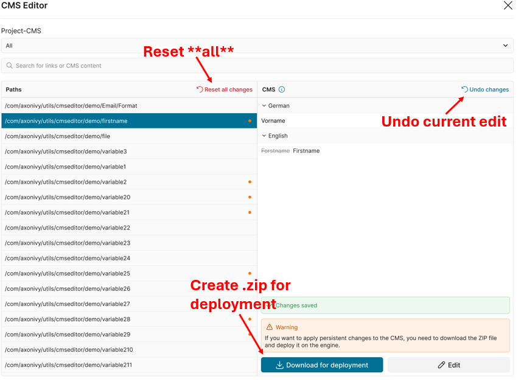

### 8. Auto Translation

The Auto Translation feature allows users to quickly translate CMS entries using DeepL, with configurable source and target languages and support for batch operations.
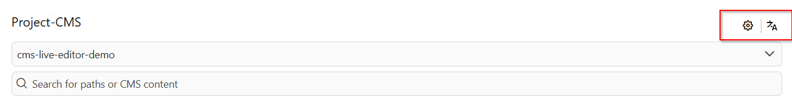

#### Configuration
A new **Settings** button (gear icon) is available in the top-right corner of the editor.

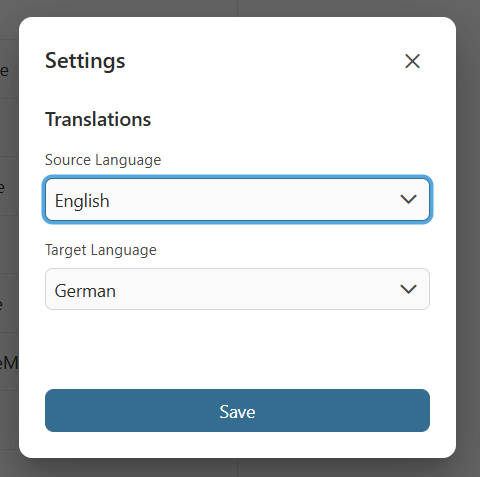

In the **Settings** dialog, users can:
- Define the **Source Language** (leading language for translation)
- Define the **Target Language**

These settings are applied when performing auto-translation.

#### Selecting Entries
Users can select CMS entries directly in the translation table:
- Click to select a single entry
- Use **Shift + Click** to select multiple entries
- Use **Ctrl + A** to select all entries
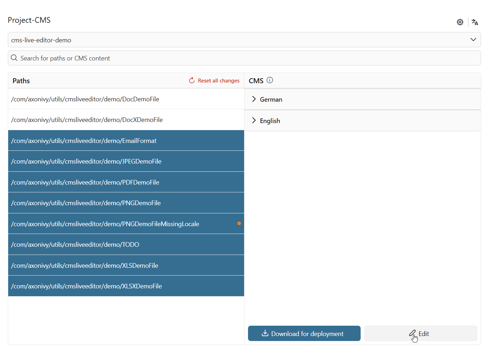

#### Auto-Translate Action
A new **Translate** button is available to translate selected entries.

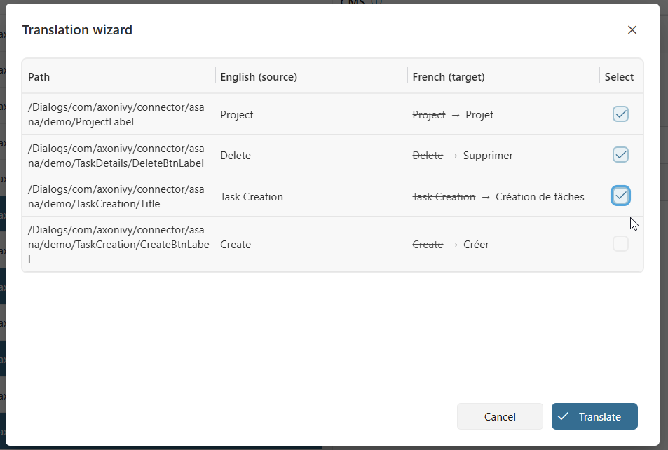

After clicking on the translate button, a dialog is displayed showing the generated translations for the selected CMS entries. Users can review the results and choose which translations to apply by selecting the corresponding checkboxes.
- Only selected CMS entries are translated
- The system uses the configured **Source Language** as input and translates into the **Target Language**
- Existing translations in the target language will be overwritten when **Translate** button is clicked

## Setup

By default, the maximum file size for CMS uploads is 50 MB. If needed, you can modify this limit by changing the configuration variable `com.axonivy.utils.cmsliveeditor.MaxUploadedFileSize`.

```
@variables.yaml@
```
> **Note**  
> To use Auto Translation with DeepL, you must configure the required variables.  
> Please refer to the official setup guide:  
> https://market.axonivy.com/deepl-connector?version=12.0.3#setup
